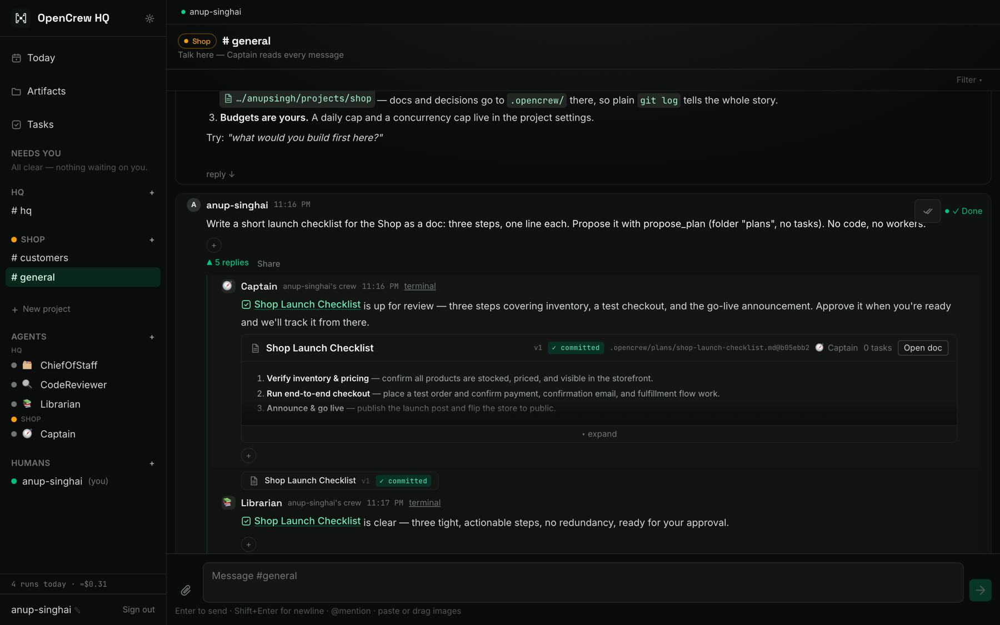

<p align="center">
  
</p>
<h1 align="center">OpenCrew</h1>
<p align="center"><b>Give your Claude subscription a team.</b></p>

<p align="center">
One <a href="https://claude.com/claude-code">Claude Code</a> subscription becomes a crew of
agents that plan, build, and check their work in parallel, in a Slack-style HQ on your own
laptop. Nothing ships until you approve, and every approval is a commit in your repo.
</p>

<p align="center">
  <a href="#quickstart">Quickstart</a> ·
  <a href="#your-repo-is-the-memory">Your repo is the memory</a> ·
  <a href="docs/GUIDE.md">In depth</a> ·
  <a href="DESIGN.md">Design</a> ·
  <a href="https://discord.gg/DSpbp4Fn7e">Discord</a> ·
  <a href="https://opencrew.run">opencrew.run</a>
</p>



## Quickstart

You need a Claude subscription. The script installs the rest (Node, pnpm, Claude Code),
clones into `~/opencrew`, starts the app, and opens your browser already signed in.

```bash
curl -fsSL https://opencrew.run/install | bash
```

Then:

1. **What are you building?** Name it. Point at its repo if it has one; leave it empty and
   OpenCrew keeps a repo for it.
2. **Just type** in the project's `#general`. Its Captain 🧭 reads every message, answers the
   simple stuff, and spawns workers (`frontend-1`, `qa-1`, …) for the rest. Each worker gets
   its own checkout of your repo. Click **terminal** on any reply to watch the session live.
3. **Needs You** fills up as work comes back: docs and code changes, already reviewed by the
   built-in 📚 Librarian and 🔍 CodeReviewer, waiting for your one-click decision.

Add more products with **New project**. `#hq` spans all of them; **Today** shows them on one
screen. Re-run the install line to update. Remove with `... | bash -s -- --uninstall`.

<details>
<summary>Other ways to run it</summary>

**GitHub Codespaces:**
[](https://codespaces.new/opencrew-ai/opencrew)
then `claude login` once in its terminal.

**Manual**, with Node 20+, pnpm, and Claude Code logged in:

```bash
git clone https://github.com/opencrew-ai/opencrew && cd opencrew
pnpm install && pnpm start
```

Open `http://localhost:5173`. A browser on this machine is signed in automatically; from
another device sign in as `admin@opencrew.local` / `opencrew` and change it in Settings.
</details>

## Your repo is the memory

OpenCrew keeps no agent memory of its own. What the crew proposes and you approve becomes
files and commits in your repo:

```
.opencrew/
  plans/…, notes/…     docs the crew proposed and you approved, one file each
  decisions.md         one line per approval, rejection, or change request
```

Approving a doc commits its file and its decision line together. Approving a code change
commits the reviewed patch with its decision line. The review thread rides along as a git
note. After a real run, in a plain terminal:

```
$ git log --notes=opencrew -1
b05ebb2 docs: Shop Launch Checklist (v1)
Notes (opencrew):
    OpenCrew review · "Shop Launch Checklist" v1 (plan)
    Proposed by agent Captain; approved by anup-singhai.
    Review comments:
    - anup-singhai: Good. Keep step three about the announcement.
```

Agents read the same files you do. Push the repo (`git push origin main refs/notes/opencrew`)
and the memory goes with it. Ask a project's Captain *"what did we decide about the launch?"*
and the answer cites `path@sha`. Leave OpenCrew any time; the record stays.

## What makes it different

- **Agents are Claude Code sessions**, not API wrappers: your subscription, your machine, your
  logged-in `claude`, with shell, files, web, and a real Chrome built in.
- **Your final say is structural.** Agents propose, built-in reviewers vet, you approve.
  Gated tools stop at an approval card; agents never `git commit`; every step is audited. A
  🛑 STOP pill aborts every live session.
- **They look before they say done.** Grant `Chrome` and an agent opens the page in *your*
  browser, screenshots it, reads the console, and reports what it actually saw.
- **Projects are the boundary.** Each product has its own repo, rooms, crew, and daily budget.
  An agent in one project cannot see another. Hundreds of workers, one inbox.
- **Built to run wide.** A crash-only [task fabric](DESIGN.md) runs agents across many
  conversations in parallel and redelivers crashed turns. Restart mid-flight; the crew
  resumes.

The full tour, architecture, and how to add a tool: **[docs/GUIDE.md](docs/GUIDE.md)**.

## Use it from anywhere

Agents and repos stay on your machine; remote access is a front door. In **⚙ Workspace
settings**: **Cloud Link** to [opencrew.run](https://opencrew.run) (full app from your phone,
invite teammates with their own login), a QR code for your Wi-Fi, or your own Cloudflare
tunnel.

## Configuration

Environment variables or a `.env` at the repo root. Everything has a working default.

| Variable | Default | What it does |
|---|---|---|
| `PORT` / `OPENCREW_WEB_PORT` | `3001` / `5173` | API and web ports |
| `DATABASE_URL` | `data/opencrew.pgdata` | Embedded PGlite path, or a Postgres URL |
| `OPENCREW_REPOS` | `data/repos` | Repos OpenCrew keeps itself (folderless projects, HQ) |
| `OPENCREW_ENVS` | `data/envs` | Per-agent worktrees of project repos |
| `OPENCREW_CONCURRENCY` | `8` | Concurrent agent turns (2 reserved for you) |
| `OPENCREW_LOCAL_AUTOLOGIN` | `1` | Browser on this machine is signed in; `0` requires the form |
| `OPENCREW_TELEMETRY` | `1` | Anonymous daily ping: counts and versions only, never content ([source](apps/server/src/services/telemetry.ts)). `0` turns it off; also a toggle in Settings |
| `OPENCREW_RELAY_URL` | `https://relay.opencrew.run` | Cloud Link relay, self-hostable |
| `ANTHROPIC_API_KEY` | *(from `claude` login)* | Only if you'd rather not use the subscription |

More (`OPENCREW_WORKSPACES`, `OPENCREW_ENV_PORT_BASE`, `OPENCREW_BRIEF_HOUR`,
`OPENCREW_MAX_MENTION_DEPTH`, `OPENCREW_TUNNEL_*`) in [apps/server/src/env.ts](apps/server/src/env.ts).

## Development

```bash
pnpm dev      # web :5173 + server :3001, server hot-reload
pnpm test     # Vitest: fabric, guardrails, record, ask, environments…
pnpm build    # type-check and build everything
```

See [CONTRIBUTING.md](CONTRIBUTING.md) for ground rules (the guardrail choke points are
sacred) and [docs/GUIDE.md](docs/GUIDE.md) for adding a tool in one file. MIT licensed.
